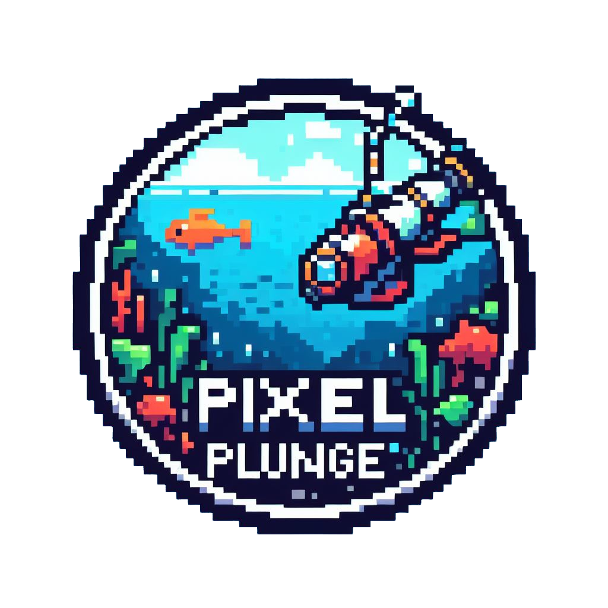

<!-- PROJECT SHIELDS -->


Pixel Plunge is a deep sea fishing game, where the aim is to catch as many fish as possible before the oxygen runs out!
<br>

Users can upgrade equipment to extend their dive times, and also check what fish they have caught and what fish they are missing in the 'fishidex'!
<br>

Give it a try and see if you can top the leaderboard!

<a href="https://pixel-plunge.netlify.app/">View Deployed App</a>

<br>

<!-- TABLE OF CONTENTS -->
<details>
  <summary>Table of Contents</summary>
  <ol>
    <li>
      <a href="#developers">Developers</a>
    </li>
    <li>
      <a href="#tech-stack">Tech Stack</a>
    </li>
    <li><a href="#how-to-clone-and-run-locally">How to clone and run locally</a></li>
  </ol>
</details>

## Developers:

- Jordan Eckford [![LinkedIn][linkedin-shield]][linkedin-url-je] [![github][github-shield]][github-url-je]
- Tom Lacy-Alcock [![LinkedIn][linkedin-shield]][linkedin-url-tla] [![github][github-shield]][github-url-tla]
- Max Field [![LinkedIn][linkedin-shield]][linkedin-url-mf] [![github][github-shield]][github-url-mf]
- Luke Riches [![LinkedIn][linkedin-shield]][linkedin-url-lr] [![github][github-shield]][github-url-lr]
- Isaac Madden [![LinkedIn][linkedin-shield]][linkedin-url-im] [![github][github-shield]][github-url-im]

## Tech Stack:

  <br>
  
  * <a href='https://phaser.io'></a>

  * [![React][React.js]][React-url]
  * [![Javascript][Javascriptimg]][Javscript-url]
  * [![React-Router][ReactRouterimg]][ReactRouter-url]
  * [![Netlify][Netlifyimg]][Netlify-url]
  * [![Firebase][Firebaseimg]][Firebase-url]
  * [![Vite][Viteimg]][Vite-url]


## How to clone and run locally:

1. Clone the repo

```sh
git clone https://github.com/sting-arrays/pixel-plunge.git
```


2. Open your terminal and navigate to your desired file path

```sh
cd pixel-plunge
```

3. Install the required packages

```sh
npm install
```

4. Create a local server

```sh
npm run dev
```

Open the link shown in the terminal and have fun!




<!-- MARKDOWN LINKS & IMAGES -->
[linkedin-shield]: https://img.shields.io/badge/-LinkedIn-black.svg?style=for-the-badge&logo=linkedin&colorB=555

[linkedin-url-tla]: https://www.linkedin.com/in/tom-lacy-alcock-b28b84283/
[linkedin-url-je]: https://www.linkedin.com/in/jordan-eckford-3a6b18103/
[linkedin-url-im]: https://www.linkedin.com/in/isaac-madden-5a1097213/
[linkedin-url-lr]: https://www.linkedin.com/in/luke-riches-a18792260/
[linkedin-url-mf]: https://www.linkedin.com/in/maxwell-field/

[github-shield]: https://img.shields.io/badge/GitHub-100000?style=for-the-badge&logo=github&logoColor=white

[github-url-tla]: https://github.com/JordanEckford
[github-url-je]: https://github.com/tomalcock
[github-url-im]: https://github.com/Isaac-Madden
[github-url-lr]: https://github.com/LukeRiches
[github-url-mf]: https://github.com/muxappo

[React.js]: https://img.shields.io/badge/React-20232A?style=for-the-badge&logo=react&logoColor=61DAFB
[React-url]: https://reactjs.org/
[Javascriptimg]:https://img.shields.io/badge/JavaScript-F7DF1E?style=for-the-badge&logo=javascript&logoColor=black
[Javscript-url]:https://www.javascript.com
[ReactRouterimg]:https://img.shields.io/badge/React_Router-CA4245?style=for-the-badge&logo=react-router&logoColor=white
[ReactRouter-url]:https://reactrouter.com/en/main
[Netlifyimg]:https://img.shields.io/badge/Netlify-00C7B7?style=for-the-badge&logo=netlify&logoColor=white
[Netlify-url]:https://www.netlify.com
[Firebaseimg]: https://img.shields.io/badge/Firebase-039BE5?style=for-the-badge&logo=Firebase&logoColor=white
[Firebase-url]: https://firebase.google.com
[Viteimg]: https://img.shields.io/badge/vite-%23646CFF.svg?style=for-the-badge&logo=vite&logoColor=white
[Vite-url]: https://vitejs.dev